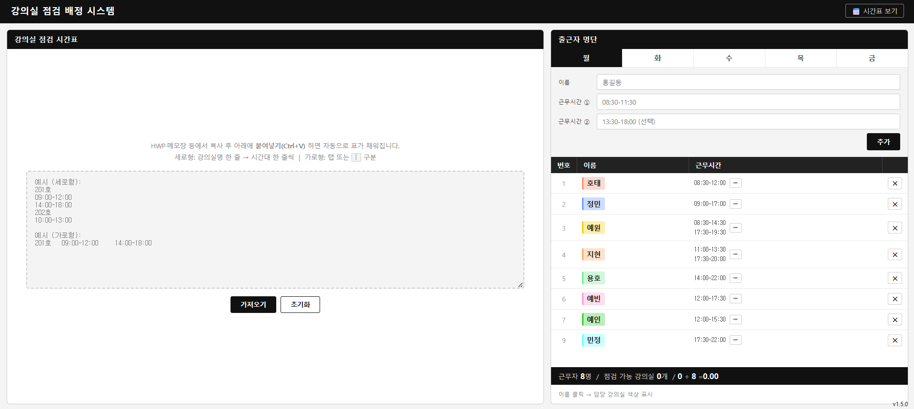

## 교학1팀 자동 점검 배정 사이트

교학1팀의 핵심 업무 중 하나인 강의실 점검표를 컴퓨터 알고리즘으로 자동 생성하는 사이트입니다.

### 사이트 미리보기



---

### 기존 방식의 문제 😟

매 아침마다 근로 학생이 아래 상황을 모두 고려하며, 짧게는 20분, 길게는 1시간씩 점검표를 직접 작성해왔습니다.

1. 강의가 없는 강의실과 해당 시간대를 파악한다.
2. 해당 강의실에 행사가 잡혀 있는지 확인한다.
3. 당일 출퇴근하는 근로 학생 명단을 확인한다.
4. 빈 시간대에 근로 학생을 **적절히** 배치한다.

✅ 문제는 "**적절히**"라는 기준이 사람마다 달라 매번 고민이 필요했다는 점입니다.
이 추상적인 기준을 아래 네 가지 규칙으로 정의하고 알고리즘에 적용했습니다.

### 점검 배정의 기준

1. **균등 배분** — 학생 1인당 점검 강의실 수의 오차는 ±1 이내로 한다.
2. **한 번에 점검** — 한 타임에 모아서 끝낼 수 있도록 배치한다. (ex. 15시에 시작하면 나중에 다시 나갈 일이 없도록)
3. **층수 최소화** — 한 번의 점검에서 이동하는 층은 최대 2개 이내로 한다. (ex. 3층·4층·8층처럼 많은 층을 오가는 경우 제외)
4. **퇴근 전 여유** — 퇴근 50분 전 이후로는 배정하지 않는다. (점검 1회 소요 시간이 30~40분임을 고려)

이 사이트 덕분에 절약되는 매일 아침 30분, 돈으로 환산하면 **5,160원의 가치**입니다.

---

### 사이트 기능

#### 1. 강의실 데이터 붙여넣기

HWP·메모장 등에서 강의실 점검 시간표를 복사한 뒤 붙여넣기(Ctrl+V)하면 자동으로 표가 완성됩니다.
세로형(강의실명 → 시간대 순)과 가로형(탭 또는 `|` 구분) 두 가지 형식을 모두 지원합니다.

#### 2. 자동 배정 / 다시 배정

근로자 목록이 등록된 상태에서 **⚡ 자동 배정** 버튼을 누르면 위 네 가지 규칙을 만족하는 배정표가 즉시 생성됩니다.
결과가 마음에 들지 않으면 **🔀 다시 배정**으로 다른 조합을 시도할 수 있습니다.

#### 3. 수동 배정 모드

**✏ 수동 모드**를 활성화하면 근로자를 직접 선택해 강의실에 클릭으로 배정·변경·해제할 수 있습니다.
자동 배정 결과를 세밀하게 수정할 때 유용합니다.

#### 4. 요일별 출근자 자동 로드

요일 버튼을 클릭하면 해당 요일의 출근자 명단과 근무 시간이 자동으로 불러와집니다.

#### 5. 근로시간표 엑셀 불러오기

**📅 시간표 보기** 화면에 근로시간표 엑셀 파일(`.xlsx`)을 **끌어다 놓으면** 근무자 명단과
근무 시간, 사람별 색이 한 번에 채워집니다. 파일이 잘 안 읽히면 엑셀에서 표를 복사해
붙여넣어도 같은 결과가 나옵니다.

적용 전에 요일별 인원수와 명단을 미리 보여주고, 확인이 필요한 항목이 있으면 알려줍니다.
**적용**을 누를 때만 시간표가 바뀌므로, 파싱이 어긋나도 기존 시간표를 잃지 않습니다.

읽을 수 있는 형태:

```
2026학년도 2학기 근로시간표          <- 제목 (선택)
시간          월                     화              <- 요일 헤더
08:30~09:00   예인  동균  소은       선우  준호
09:00~09:30   예인  동균  소은       선우
```

- 요일 칸에는 **이름만** 적혀 있으면 됩니다. 요일별 칸 수가 달라도 됩니다.
- 같은 칸을 시간대에 따라 여러 사람이 번갈아 써도 사람 단위로 알아서 묶습니다.
- 시간이 30분 단위든 1시간 단위든, 시작·종료 시각이 몇 시든 그대로 읽습니다.

학기가 바뀌어 근무자가 교체되면 **엑셀만 새로 불러오면 되고, 코드를 고칠 필요가 없습니다.**

#### 6. 시간표 직접 편집

셀을 **왼쪽 버튼으로 드래그**하면 근무 시간이 추가되고, **오른쪽 버튼으로 드래그**하면
삭제됩니다. 시간이 모두 없어진 근무자는 그 요일에서 빠집니다.

표 위쪽 명단에서 이름과 색을 고치거나 모든 요일에서 한 번에 삭제할 수 있고,
제목도 클릭해서 수정할 수 있습니다. 모든 변경은 자동으로 브라우저에 저장됩니다.

#### 7. 행사 추가

특정 강의실에 행사 시간을 등록하면 해당 시간대는 자동으로 점검 불가 처리됩니다.
자동 배정 시에도 행사 시간은 제외됩니다.

#### 8. 근무자 클릭으로 배정 현황 확인

오른쪽 패널에서 근무자 이름을 클릭하면 해당 근무자가 담당하는 강의실 행이 강조 표시되고 나머지 행은 흐리게 처리됩니다.

이름을 클릭하지 않아도 오른쪽 패널의 각 근무자 행에서 아래 정보를 바로 확인할 수 있습니다.

- **담당 강의실 목록과 개수** — "N개 담당" 뱃지와 함께 강의실 호수가 나열됩니다.
- **이동 횟수** — "1회 이동", "2회 이동" 등으로 몇 번 나가야 하는지 표시됩니다.
- **방문 층수** — "3층·4층" 형식으로 어느 층을 오가는지 표시됩니다.

#### 9. 표 복사

배정이 완료된 후 **📋 표 복사** 버튼을 누르면 결과를 HWP 표에 바로 붙여넣을 수 있는 형식으로 클립보드에 복사됩니다.

---

### 사용 방법

사용 방법은 굉장히 직관적으로 구현되어 있어, 근로 학생이라면 누구나 쉽게 쓸 수 있습니다.

1. **강의실 데이터 입력** — 왼쪽 붙여넣기 영역에 강의실 시간표를 붙여넣습니다.
2. **출근자 로드** — 오른쪽 패널에서 오늘 요일 버튼을 클릭해 출근자를 불러옵니다.
3. **자동 배정 실행** — **⚡ 자동 배정** 버튼을 클릭합니다.
4. **결과 확인 및 수정** — 미배정 강의실이 있거나 조정이 필요하면 수동 모드로 수정합니다.
5. **결과 복사** — **📋 표 복사** 버튼으로 HWP에 바로 붙여넣습니다.

붙여넣기 예시는 아래와 같습니다.

```
| 201호  | 17:30-22:00                  |
| 204호  | 20:10-22:00                  |
| 209호  | 14:40-20:00                  |
| 211호  | 09:00-22:00                  |
| 301호  | 09:00-14:30| 20:10-22:00     |
| 302호  | 20:10-22:00                  |
| 303호  | 19:10-22:00                  |
| 304호  | 20:10-22:00                  |
| 308호  | 20:10-22:00                  |
| 309호  | 09:00-11:40                  |
| 310호  | 09:00-11:40| 20:10-22:00     |
| 311호  | 11:50-14:30| 17:30-20:00     |
| 401호  | 17:30-22:00                  |
| 402호  | X                            |
| 403호  | 09:00-14:30                  |
| 404호  | 17:30-22:00                  |
| 408호  | 11:50-14:30| 20:10-22:00     |
| 409호  | 11:50-14:30                  |
| 410호  | 17:30-22:00                  |
| 411호  | X                            |
| 501호  | 13:50-17:20| 19:10-22:00     |
| 502호  | 17:30-22:00                  |
| 503호  | 13:40-17:20| 19:10-22:00     |
| 601호  | 09:00-11:40| 19:10-22:00     |
| 602호  | 09:00-14:30| 19:10-22:00     |
| 603호  | 11:50-14:30| 19:10-22:00     |
| 607호  | 09:00-11:40                  |
| 701호  | 20:10-22:00                  |
| 702호  | 11:50-14:30| 18:20-20:00     |
| 703호  | 09:00-11:40| 17:30-22:00     |
| 708호  | 20:10-22:00                  |
| 709호  | 09:00-11:40| 18:20-22:00     |
| 801호  | 09:00-11:40| 17:30-20:10     |
| 802호  | 17:30-20:00                  |
| 803호  | 17:30-22:00                  |
| 806호  | 09:00-11:40| 17:30-20:20     |
| 807호  | 09:00-11:40| 17:30-20:10     |
| 808호  | 09:00-11:40| 17:30-20:00     |
| b108호 | 09:00-22:00                  |
```

---

### 기술 스택

- React 18 + Vite 6
- 외부 UI 라이브러리 없이 순수 CSS 작성
