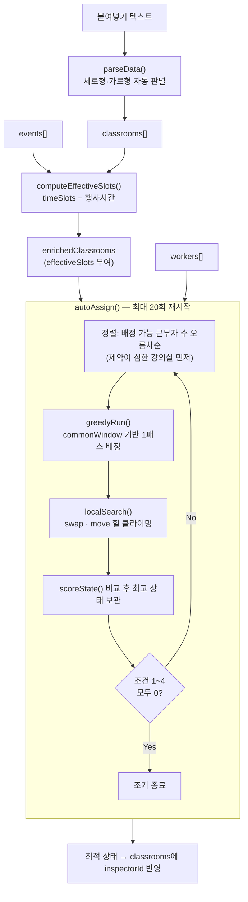
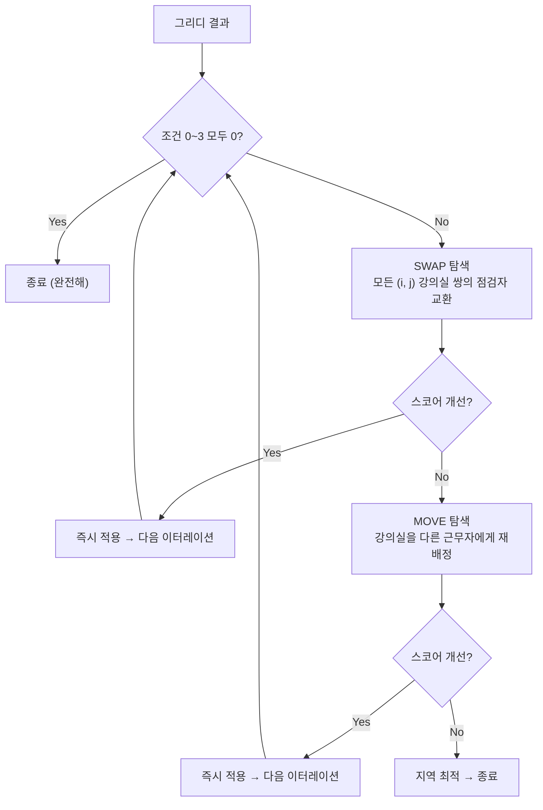

# 강의실 점검 자동 배정 알고리즘 분석

> 대상 코드: [src/utils.js](../src/utils.js) (배정 엔진 전체), [src/App.jsx](../src/App.jsx) (엔진 호출부)
> 테스트: [tests/algorithm.test.js](../tests/algorithm.test.js) — `node tests/algorithm.test.js`

---

## 1. 문제 정의

### 1.1 입력

| 항목 | 형태 | 설명 |
|---|---|---|
| `classrooms` | `[{ id, room, timeSlots[], inspectorId }]` | 강의실과 "강의가 없는 = 점검 가능" 시간대 (최대 3개) |
| `workers` | `[{ id, number, name, workTimes[] }]` | 당일 출근자와 근무 시간대 (최대 2개, 분리 근무 지원) |
| `events` | `[{ id, room, time }]` | 특정 강의실의 행사 시간 (점검 불가 구간) |

### 1.2 출력

`classrooms`의 각 항목에 `inspectorId`가 채워진 배열. 배정 불가한 강의실은 `inspectorId: null`로 남습니다.

### 1.3 최적화 목표

README에 정의된 4개 업무 규칙이 코드상 다음과 같이 매핑됩니다.

| 업무 규칙 | 코드 구현 | 위치 |
|---|---|---|
| 균등 배분 (±1) | `imbalance` = max load − min load, `maxLoad` = ⌈C/W⌉+1 상한 | `scoreState`, `autoAssign` |
| 한 번에 점검 | `countTrips(...) === 1`, `commonWindow` 교집합 추적 | `countTrips`, `greedyRun` |
| 층수 최소화 (≤2) | `maxFloors = 2`, `floorPenalty`, `totalFloorSpan` | `greedyRun`, `scoreState` |
| 퇴근 전 여유 | `EARLY_FINISH_MIN = 40` 분을 근무 종료에서 차감 | `getEffectiveWorkRange` |

> **주의 — 문서와 코드 불일치**: README는 "퇴근 **50분** 전"이라고 설명하지만 실제 상수 `EARLY_FINISH_MIN`은 **40**입니다 ([src/utils.js:6](../src/utils.js#L6)). 테스트도 40 기준으로 작성되어 있으므로, 코드가 사실이고 README가 낡은 값입니다.

이는 **다목적 제약 만족 + 최적화 문제**이며, 일반화하면 시간 창(time window) 제약이 있는 작업 배정 문제 — NP-hard 계열입니다. 그래서 코드는 정확해(exact solution)를 포기하고 **다중 시작 그리디 + 지역 탐색(multi-restart greedy + local search)** 휴리스틱을 씁니다.

---

## 2. 전체 파이프라인



---

## 3. 기반 연산 계층

모든 시간은 `"HH:MM"` 문자열을 **자정 기준 분(minute) 정수**로 바꿔 다룹니다. 구간은 `{ s, e }` (시작·종료, 분).

### 3.1 파싱과 겹침 판정

```js
toMin("09:30")            // → 570
parseRange("09:00-12:00") // → { s: 540, e: 720 }   (구분자 '-' 또는 '~')
overlaps(a, b)            // → a.s < b.e && a.e > b.s
```

`overlaps`는 **열린 구간 겹침**입니다. `09:00-11:00`과 `11:00-13:00`은 경계만 맞닿으므로 **겹치지 않음**으로 판정합니다(테스트 "overlaps 안 겹침 (연속)"으로 고정).

### 3.2 유효 근무 범위 — 퇴근 전 여유

```js
getEffectiveWorkRange("17:30-22:00")  // → { s: 1050, e: 1280 }  (21:20까지)
getEffectiveWorkRange("17:30-18:00")  // → null  (40분 차감 후 길이 ≤ 0)
```

점검 1회에 30~40분이 걸리므로 **퇴근 40분 전 이후로는 점검을 시작할 수 없다**는 규칙을 "근무 종료 시각에서 40분을 뺀 유효 범위"로 모델링합니다. 40분 이하의 짧은 근무 블록은 `null`이 되어 아예 배정 대상에서 제외됩니다.

### 3.3 행사 차감 — 구간 뺄셈

`subtractEventFromSlot(slot, event)`은 한 슬롯에서 행사 구간을 뺀 **나머지 조각들**을 돌려줍니다. 결과는 0·1·2개입니다.

| 케이스 | 예시 (슬롯 `09:00-18:00`) | 결과 |
|---|---|---|
| 겹침 없음 | 행사 `19:00-20:00` | `["09:00-18:00"]` |
| 앞부분 차단 | 행사 `08:00-12:00` | `["12:00-18:00"]` |
| 뒷부분 차단 | 행사 `15:00-19:00` | `["09:00-15:00"]` |
| 중간 차단 | 행사 `12:00-14:00` | `["09:00-12:00", "14:00-18:00"]` ← **조각 2개** |
| 전체 차단 | 행사 `08:00-19:00` | `[]` |

`computeEffectiveSlots`는 해당 강의실의 모든 행사를 `flatMap`으로 **누적 차감**합니다. 중간 차단으로 조각이 늘어난 뒤 다음 행사가 그 조각들에 다시 적용되므로 행사 여러 개가 중첩돼도 정확합니다.

```js
let slots = [...classroom.timeSlots];
for (const evt of roomEvents) {
  slots = slots.flatMap(slot => subtractEventFromSlot(slot, evt.time));
}
```

> **설계 디테일**: 행사가 없으면 `classroom.timeSlots`를 **같은 참조로 그대로** 반환합니다. [App.jsx](../src/App.jsx)가 `effectiveSlots === c.timeSlots`로 참조 비교해 불필요한 객체 생성과 리렌더를 건너뛰기 때문에, 이 참조 동일성은 의도된 계약입니다.

### 3.4 배정 가능성 판정

```
canInspect(worker, classroom)
  = ∃ wt ∈ worker.workTimes,
    ∃ slot ∈ (classroom.effectiveSlots ?? classroom.timeSlots)
    : overlaps(getEffectiveWorkRange(wt), parseRange(slot))
```

`getSlots()`가 `effectiveSlots ?? timeSlots`를 고르므로, 행사가 반영된 슬롯이 있으면 그것을 우선합니다. 즉 **행사 차단은 배정 가능성 판정에 자동으로 전파**됩니다.

---

## 4. 이동 횟수 계산 — `countTrips`

"한 번에 점검"을 평가하려면 **한 근무자의 담당 강의실들을 몇 번의 외출로 처리할 수 있는가**를 알아야 합니다. 알고리즘에서 가장 비직관적인 부분입니다.

### 4.1 모델링

한 번의 외출(trip)은 **하나의 시각**에 출발합니다. 따라서 어떤 강의실 집합을 한 번에 처리할 수 있다는 것은 = 그 강의실들의 점검 가능 구간에 **공통 교집합이 존재**한다는 것입니다.

각 강의실의 방문 가능 구간은 **근무자의 유효 근무 범위 ∩ 강의실 슬롯**으로 좁혀집니다. 두 구간 리스트의 교집합은 `intersectRangeLists`가 이중 루프로 모든 쌍을 훑어 계산합니다(구간 리스트가 정렬돼 있다고 가정하지 않는 O(|A|·|B|) 방식 — 조각이 최대 3~6개이므로 실용상 무해).

```js
function intersectRangeLists(A, B) {
  // 모든 (a, b) 쌍에 대해 [max(s), min(e)]가 비지 않으면 채택
}
```

### 4.2 그리디 빈 패킹

```js
const sorted = [...available].sort((a, b) => a.length - b.length); // 조각 적은 것 먼저
const trips = [];
for (const slots of sorted) {
  // 기존 trip 중 교집합이 살아남는 첫 번째 trip에 합침
  // 없으면 새 trip 생성
}
return trips.length;
```

각 `trips[t]`는 **그 trip에 속한 강의실 전체의 공통 창(common window)** 을 들고 있고, 새 강의실을 넣으면 창이 더 좁아집니다. 좁아진 창이 비면 그 trip에는 넣을 수 없습니다.

이는 **first-fit 그리디**입니다. 유연성이 낮은(조각 수가 적은) 강의실을 먼저 배치해 실패 확률을 줄이지만, **최소 trip 수를 보장하지는 않습니다.** 정확한 최소값은 구간 그래프의 클리크 분할 문제이므로, 여기서는 "일관되게 계산되는 상한값"으로 충분하다고 판단한 근사입니다. 실제 데이터에서 담당 강의실이 3~5개 수준이라 오차가 발생할 여지가 거의 없습니다.

---

## 5. 층 관련 연산

```js
getFloor("305호")  // → 3
getFloor("b108호") // → 1   (정규식이 첫 숫자 덩어리 "108"만 추출)
getFloor("50호")   // → null (Math.floor(50/100) % 10 === 0 → `|| null`)
```

구현은 `Math.floor(n / 100) % 10 || null`입니다.

- `getWorkerFloors(classrooms, workerId)` → 담당 층의 `Set`
- `workerFloorSpan(classrooms, workerId)` → `max(층) − min(층)`, 층이 1개 이하면 0

`Span`은 "층 개수"와 다릅니다. 3·4층 담당(개수 2, span 1)과 3·8층 담당(개수 2, span 5)을 구별하려는 지표이며, **인접 층 선호**를 스코어에 넣기 위해 존재합니다.

> **한계**: `% 10` 때문에 4자리 호수(예: `1203호`)는 12층이 아니라 2층으로 계산됩니다. 현재 건물이 8층까지라 문제가 없지만, 다른 건물로 확장하면 깨지는 지점입니다.

---

## 6. 스코어 함수 — 사전식 6-튜플

```js
scoreState(state, workers, maxLoad, maxFloors)
  // → [tripsOver1, loadViolations, floorViolations, imbalance, totalFloorSpan, totalTrips]
```

| # | 항목 | 의미 | 성질 |
|---|---|---|---|
| 0 | `tripsOver1` | 2회 이상 나가야 하는 근무자 수 | 위반 카운트 |
| 1 | `loadViolations` | `maxLoad` 초과 근무자 수 | 위반 카운트 |
| 2 | `floorViolations` | `maxFloors` 초과 근무자 수 | 위반 카운트 |
| 3 | `imbalance` | 최대 배정 수 − 최소 배정 수 | 연속값 |
| 4 | `totalFloorSpan` | 전원의 층 범위 합 | 연속값 (타이브레이커) |
| 5 | `totalTrips` | 전원의 이동 횟수 합 | 연속값 (타이브레이커) |

비교는 `scoreBetter(a, b)`가 **사전식(lexicographic)** 으로 수행합니다. 앞 항목에서 차이가 나면 뒤 항목은 보지 않습니다. 즉 **엄격한 우선순위**이며, 가중치 합산이 아니어서 "이동 위반 1건을 균등도 개선 3점으로 상쇄" 같은 뒤바뀜이 원천적으로 불가능합니다.

`imbalance`를 위반 카운트가 아닌 연속값으로 둔 것은 주석에 명시된 의도입니다.

```js
// 연속값으로 써야 9→8→7 식으로 한 단계씩 개선을 인식할 수 있음
```

위반 카운트만 쓰면 지역 탐색이 "아직 위반, 아직 위반"만 보고 **개선 방향의 기울기를 잃습니다.** 연속값이 힐 클라이밍의 경사면을 만들어 줍니다.

> **관찰**: `imbalance`는 배정이 0개인 근무자도 `loads`에 포함합니다. 따라서 점검 가능한 강의실이 하나도 없는 근무자(근무시간이 모든 슬롯과 어긋나는 사람)가 있으면 `min = 0`이 고정되어 **`imbalance`가 절대 0이 되지 않습니다.** 결과적으로 `autoAssign`과 `localSearch`의 조기 종료 조건(`best[3] === 0`)이 발동하지 않고 재시작 20회를 항상 완주합니다. 결과 품질에는 영향이 없고 수행 시간만 늘어나는 성질입니다.

---

## 7. 1단계: 그리디 배정 — `greedyRun`

### 7.1 정렬 — 제약 전파

```js
const eligibleCount = c => workers.filter(w => canInspect(w, c)).length;
const baseSorted = [...assignable].sort((a, b) => eligibleCount(a) - eligibleCount(b));
```

**배정 가능한 근무자가 적은 강의실부터** 처리합니다. 제약 만족 문제의 고전적인 MRV(Minimum Remaining Values) 휴리스틱으로, 선택지가 1명뿐인 강의실을 뒤로 미뤄서 그 1명이 이미 꽉 차 버리는 상황을 막습니다.

### 7.2 핵심 아이디어 — `commonWindows`

근무자별로 **지금까지 배정된 강의실 전부의 공통 시간 교집합**을 `Map`으로 들고 다닙니다. 초기값은 유효 근무 범위입니다.

```js
const commonWindows = new Map(
  workers.map(w => [w.id, w.workTimes.map(getEffectiveWorkRange).filter(Boolean)])
);
```

새 강의실을 후보 근무자에게 붙였을 때 이 창이 **비지 않으면 1회 이동이 유지**됩니다. 이것이 `countTrips`를 매번 다시 돌리지 않고도 "한 번에 점검"을 증분(incremental)으로 판정하는 트릭입니다.

```js
const newWindow = intersectRangeLists(prevWindow, classroomSlots);
const keepsOneTrip = newWindow.length > 0;
```

배정 확정 후 창을 갱신합니다.

- 창이 유지되면 → **좁혀진 창으로 교체** (다음 강의실은 더 엄격한 조건을 만족해야 함)
- 창이 비면 → 어쩔 수 없는 2회 이동. **이 강의실 슬롯 ∩ 유효 근무시간으로 창을 리셋**해 새 trip을 시작

### 7.3 후보 풀 축소 — 3단 폴백

배정 대상 강의실 하나마다 후보 풀을 다음 순서로 좁힙니다.

```
allEligible  (canInspect 통과 전원)
   ↓ 상한선 필터: maxLoad 미만 && (maxFloors 미만 || 이미 그 층 담당)
belowCap  →  비면 allEligible로 폴백   ← 하드 제약을 소프트하게 처리
   ↓ 부하 기준
strictPool = load ≤ globalMin
   ↓ 비면
laxPool    = load ≤ globalMin + 1
   ↓ 비면
eligible   (전체)
```

**폴백이 핵심 설계입니다.** 상한선을 절대 규칙으로 두면 배정 불가(미배정 강의실 발생)가 나올 수 있는데, "가능하면 지키고, 불가능하면 넘긴다"로 두어 **완전 배정을 우선**합니다. 넘긴 위반은 `scoreState`의 `loadViolations`/`floorViolations`에 잡히고, 재시작·지역 탐색이 해소를 시도합니다.

### 7.4 후보 점수 — 가중 합산

풀 내부에서는 사전식이 아니라 **가중 합산 점수의 최소값**을 고릅니다.

```js
score = tripPenalty + floorPenalty + currentCount * 500
```

| 항목 | 값 | 근거 |
|---|---|---|
| `tripPenalty` | 1회 이동 유지 0 / 깨짐 **10000** | 다른 모든 항목의 최대치보다 커서 사실상 사전식 1순위 |
| `floorPenalty` (층 1개) | 0 | |
| `floorPenalty` (층 2개, 거리 ≤1) | 500 | 3·4층 등 인접 — 가볍게 허용 |
| `floorPenalty` (층 2개, 거리 ≤2) | 1200 | |
| `floorPenalty` (층 2개, 거리 >2) | 2500 | 3·8층 등 — 강하게 회피 |
| `floorPenalty` (층 3개) | 5000 | |
| `floorPenalty` (층 4개) | 7500 | |
| `floorPenalty` (층 5개 이상) | 9000 | 최대치가 10000 미만 — 이동 페널티를 넘지 못함 |
| 부하 | `currentCount × 500` | 균등 배분 유도 |

층 페널티 상한을 9000으로 잡아 `tripPenalty` 10000보다 **의도적으로 낮게** 둔 점이 중요합니다. "층을 5개 오가더라도 한 번에 끝내는 것이 낫다"는 우선순위가 숫자로 인코딩돼 있습니다.

> **주의**: 부하 항은 상한이 없습니다. `currentCount ≥ 20`이면 `20 × 500 = 10000`으로 이동 페널티와 맞먹게 됩니다. 현실적으로 `maxLoad ≈ ⌈C/W⌉+1` (40개 강의실 / 8명이면 6)이라 도달하지 않지만, 근무자 1~2명에 강의실이 많은 극단 입력에서는 우선순위가 뒤집힐 수 있는 지점입니다.

동점일 때 `score < bestScore`(엄격 부등호)이므로 **풀의 앞쪽이 이깁니다.** 그래서 재시작 시 `randomizePool`로 풀을 셔플하는 것이 실제로 다른 해를 만들어냅니다.

---

## 8. 2단계: 지역 탐색 — `localSearch`

그리디는 한 번 내린 결정을 되돌리지 못합니다. 그 근시안을 힐 클라이밍으로 보완합니다.



### 8.1 두 가지 이웃 연산

**SWAP** — 서로 다른 근무자에게 배정된 두 강의실의 점검자를 교환합니다. `canInspect`를 **양방향 모두** 확인해 실행 가능성을 보장합니다.

```js
if (!wi || !wj || !canInspect(wj, ci) || !canInspect(wi, cj)) continue;
```

부하 총량이 변하지 않으므로 `imbalance`는 그대로 두고 **이동 횟수와 층 분산만 개선**하는 수단입니다.

**MOVE** — 강의실 하나를 다른 근무자에게 넘깁니다. 부하가 이동하므로 `imbalance`를 직접 줄일 수 있는 유일한 연산입니다. 여기서는 `maxLoad`/`maxFloors`를 **하드 게이트로 강제**합니다(그리디의 폴백과 달리 상한을 넘는 이동은 아예 시도하지 않음).

### 8.2 전략 — first-improvement + 라벨 break

```js
swapLoop: for (...) { for (...) { if (scoreBetter(s, best)) { /* ... */ break swapLoop; } } }
```

**첫 개선을 찾는 즉시 채택하고 처음부터 다시 시작합니다**(first-improvement, best-improvement 아님). 개선 후보 전체를 평가하지 않으므로 이터레이션당 비용이 낮고, 스코어가 단조 감소하므로 무한 루프가 없습니다. 안전장치로 `MAX_ITERS = 300`이 걸려 있습니다.

SWAP을 먼저, 개선이 없을 때만 MOVE를 시도하는 순서도 의도적입니다. SWAP은 균등 배분을 깨지 않는 안전한 개선이므로 먼저 소진합니다.

**단조 감소 + 이웃 소진 시 종료** = 이 함수는 지역 최적해를 반환합니다. 전역 최적 탐색은 다음 단계가 담당합니다.

---

## 9. 3단계: 다중 재시작 — `autoAssign`

```js
const maxLoad = Math.ceil(assignable.length / workers.length) + 1;  // 평균 올림 + 1
const maxFloors = 2;
const RESTARTS = 20;

for (let run = 0; run < RESTARTS; run++) {
  const order = (!forceShuffle && run === 0) ? baseSorted : shuffledOrder();
  const greedy = greedyRun(order, workers, forceShuffle || run > 0, maxLoad, maxFloors);
  const optimized = localSearch(greedy, workers, maxLoad, maxFloors);
  const score = scoreState(optimized, workers, maxLoad, maxFloors);
  if (!bestScore || scoreBetter(score, bestScore)) { bestScore = score; bestState = optimized; }
  if (bestScore[0] === 0 && bestScore[1] === 0 && bestScore[2] === 0 && bestScore[3] === 0) break;
}
```

**지역 최적 탈출 전략**은 두 축의 무작위화입니다.

1. **강의실 처리 순서 셔플** — `shuffledOrder()`는 `eligibleCount`가 같은 강의실끼리 그룹으로 묶고 **그룹 내부만 섞습니다.** MRV 정렬(제약 전파)을 유지하면서 다양성만 얻는 방식입니다.
2. **후보 풀 셔플** — `randomizePool`이 그리디의 동점 처리 방향을 흔듭니다.

`run === 0`은 셔플하지 않은 결정적(deterministic) 실행입니다. 그래서 **⚡ 자동 배정**(`forceShuffle: false`)은 같은 입력에 재현 가능한 결과를 주고, **🔀 다시 배정**(`forceShuffle: true`)은 0회차부터 섞어 다른 조합을 뽑습니다. UI의 두 버튼 차이가 이 한 플래그에서 나옵니다.

> **참고**: 셔플에 `sort(() => Math.random() - 0.5)`를 씁니다. 균등 분포가 아닌(편향된) 셔플로 잘 알려진 관용구이지만, 여기서는 다양성 확보가 목적이고 통계적 균등성이 요구되지 않으므로 실무상 문제가 되지 않습니다. 엄밀함이 필요하면 Fisher-Yates로 교체할 수 있습니다.

**조기 종료**는 조건 0~3(이동·부하·층 위반 0, 균등도 0)이 모두 충족될 때 발동합니다. 4·5번 타이브레이커는 조기 종료 판정에 포함하지 않습니다 — 이미 "업무적으로 완벽한 표"이므로 미세 최적화를 위해 20회를 더 돌릴 이유가 없다는 판단입니다.

마지막에 `bestState`를 `Map`으로 인덱싱해 원본 `classrooms` 순서대로 되돌립니다. 슬롯이 없어 `assignable`에서 빠진 강의실(`X` 표기 등)은 원본이 그대로 유지됩니다.

---

## 10. 복잡도

기호: C = 강의실 수, W = 근무자 수, A = 배정된 강의실 수(≤ C), R = 20, I = `MAX_ITERS` 300

| 함수 | 복잡도 | 비고 |
|---|---|---|
| `canInspect` | O(1) | 근무 블록 ≤2, 슬롯 ≤3 → 상수 |
| `countTrips` | O(A_w²) | A_w = 해당 근무자 담당 수. 실제 3~6 |
| `scoreState` | **O(W · C)** | 근무자마다 `state.filter` + `getWorkerFloors` 전체 스캔 |
| `greedyRun` | **O(C² · W)** | 강의실마다 counts 재집계 O(C) + 후보마다 `getWorkerFloors` O(C) |
| `localSearch` (이터레이션당) | **O(A² · W · C)** | 개선을 못 찾으면 A² 쌍 전체를 `scoreState`로 평가 |
| `autoAssign` | O(R · I · A² · W · C) | 최악 이론값 |

실제 데이터(C ≈ 40, W ≈ 8~11)에서는 첫 개선을 즉시 채택하고 스코어가 빠르게 수렴해 이터레이션이 수십 회 수준에 머물며, 체감 수 밀리초에 끝납니다. [App.jsx](../src/App.jsx)가 `setTimeout(..., 30)`으로 감싼 것은 계산 시간 때문이 아니라 **`isAssigning` 로딩 상태를 페인트할 프레임을 확보**하기 위한 것입니다.

병목이 생긴다면 후보는 명확합니다.

- `greedyRun`의 `getWorkerFloors([...state.values()], worker.id)` — 후보 평가마다 `Map`을 배열로 펼치고 전체를 스캔합니다. `commonWindows`처럼 근무자별 층 `Set`을 증분 유지하면 O(C) → O(1)이 됩니다.
- `scoreState` — 이웃 하나를 평가할 때마다 전체 상태를 재계산합니다. SWAP/MOVE는 근무자 2명만 건드리므로 **델타 스코어링**으로 O(W·C) → O(1) 수준까지 줄일 여지가 있습니다.

---

## 11. 데이터 파서 — `parseData`

붙여넣기 텍스트에 탭 또는 `|`가 하나라도 있으면 **가로형**, 없으면 **세로형**으로 판별합니다.

```js
const hasTab  = lines.some(l => l.includes('\t'));
const hasPipe = lines.some(l => l.includes('|'));
return (hasTab || hasPipe) ? parseHorizontal(lines) : parseVertical(lines);
```

**세로형** (`parseVertical`) — 상태 기계. `/호\s*$/`로 강의실명을 인식해 새 레코드를 열고, `/^\d{1,2}:\d{2}\s*[-~]\s*\d{1,2}:\d{2}$/`에 맞는 줄을 현재 레코드의 슬롯으로 누적합니다.

**가로형** (`parseHorizontal`) — 줄을 탭 또는 `|`로 쪼개 첫 셀을 강의실명, 나머지 중 숫자를 포함한 셀을 슬롯으로 봅니다. 첫 줄이 `강의실`/`호수`/`시간`을 포함하면 헤더로 간주해 건너뜁니다.

두 파서 모두 슬롯을 **최대 3개**로 자릅니다. 시간 형식이 아닌 셀(`X` 등)은 자연히 걸러져 `timeSlots: []`가 되고, `autoAssign`의 `assignable` 필터에서 빠집니다.

---

## 12. 요약 — 설계 판단 정리

| 판단 | 이유 |
|---|---|
| 사전식 6-튜플 스코어 | 업무 규칙의 우선순위가 명확하므로 가중치 합산의 뒤바뀜 위험을 제거 |
| 그리디는 가중 합산, 상위는 사전식 | 그리디 단계는 국소 결정이라 부드러운 트레이드오프(인접 층 선호 등)가 필요 |
| `imbalance`를 연속값으로 | 힐 클라이밍에 경사면 제공 — 위반 카운트만으로는 개선 방향을 못 봄 |
| `commonWindow` 증분 추적 | `countTrips` 재계산 없이 "한 번에 점검"을 저비용으로 판정 |
| 상한선 3단 폴백 | 미배정 방지가 상한 준수보다 중요 — 위반은 스코어에 남겨 후속 단계가 해소 |
| MRV 정렬 + 그룹 내부만 셔플 | 제약 전파 이점을 유지한 채 재시작 다양성 확보 |
| first-improvement | 이터레이션당 비용을 낮추고 단조 감소로 종료 보장 |
| 층 페널티 상한 < 이동 페널티 | "층을 여러 개 오가더라도 한 번에 끝내는 게 낫다"를 숫자로 인코딩 |

### 개선 여지

1. **README의 "퇴근 50분 전"을 40분으로 수정** (또는 `EARLY_FINISH_MIN`을 50으로). 문서와 코드가 어긋나 있습니다.
2. **`canInspect`가 겹침 길이를 보지 않습니다.** 1분만 겹쳐도 배정 가능으로 판정됩니다. 점검 소요 시간이 30~40분이라는 전제를 살리려면 `overlaps` 대신 최소 교집합 길이 조건이 더 정확합니다(현재는 `EARLY_FINISH_MIN` 차감이 이 역할을 간접적으로 대신하고 있습니다).
3. **`getFloor`의 `% 10`** — 4자리 호수(1203호)를 오분류합니다. 8층 건물 전제에 묶인 구현입니다.
4. **배정 0개 근무자가 `imbalance`를 고정**시켜 조기 종료를 막습니다. 배정 가능 강의실이 없는 근무자를 `loads` 집계에서 제외하면 해소됩니다.
5. **`countTrips`의 first-fit**은 최소 trip 수를 보장하지 않습니다. 담당 강의실이 많아지면 과대 계상이 나올 수 있습니다.
6. **델타 스코어링**과 `greedyRun`의 층 `Set` 증분 유지로 상수 배 성능 개선이 가능합니다.
7. **`maxFloors = 2` 하드코딩** — 업무 규칙이 바뀌면 UI 설정으로 뽑아내는 편이 낫습니다.
